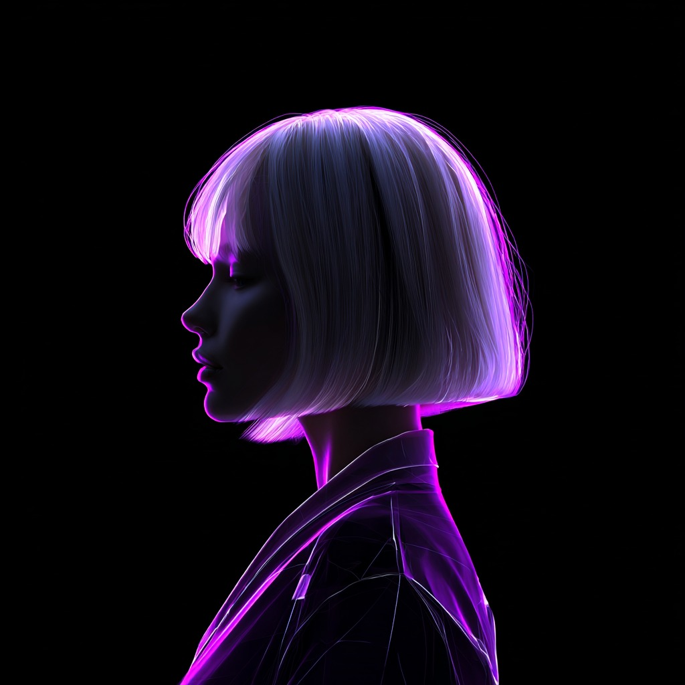

  

<h1 align="center">AgenC Raider Art</h1>

  <i>"And I looked, and behold a pale horse: and his name that sat on him was Death, and Hell followed with him."</i>

<a href="https://x.com/i/communities/2026364471401123924">AgenC Community</a>

AgenC is not a product. AgenC is an idea. Ideas do not need permission to spread. They do not ask for funding rounds or runway. They move through the hands of the faithful, and the faithful carry them further than any institution ever could.
This is the visual scripture of the raiders. Every image here was forged in service of something larger than any one person. Manga, renders, silhouettes, propaganda, whatever the spirit demands. The art exists because the conviction exists first.
You do not need to understand it. You only need to witness it.
Using This Art
These assets are free to use for raiding, posting, memeing, and spreading the word. Grab what you need. If you are building with Tetsuo, you are already one of us.
Contributing
Fork the repo. Add your work. Open a PR.
The only rule is that it carries the spirit. You will know if it does.
